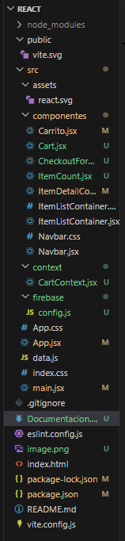
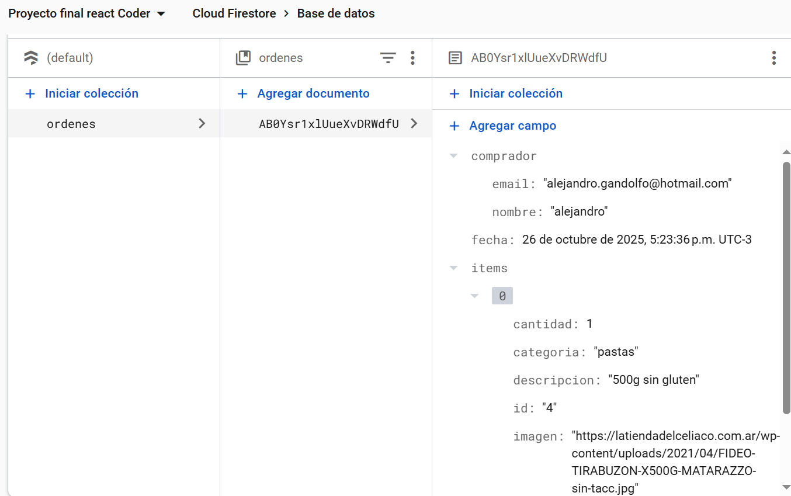

# Proyecto Final React - CoderHouse

## Descripción

Este proyecto es una aplicación de e-commerce desarrollada en **React**, creada como entrega final del curso de **React JS de CoderHouse**.  
El objetivo es simular una tienda online para usuarios celiacos, donde se pueden visualizar productos, filtrarlos por categoría, ver los detalles y realizar una compra.

---

## Tecnologías utilizadas

- **React JS** – Framework principal para la construcción de la interfaz.
- **React Router DOM** – Manejo de rutas y navegación.
- **Firebase Firestore** – Base de datos en la nube para almacenar las órdenes de compra.
- **Vite** – Entorno de desarrollo rápido.
- **CSS** – Estilos personalizados.

---

## Funcionalidades principales

- Visualización de todos los productos.
- Filtrado por categorías.
- Vista de detalle individual de cada producto.
- Carrito de compras con cantidad y total dinámico.
- Formulario de finalización de compra con guardado en **Firebase Firestore**.
- Limpieza del carrito una vez finalizada la compra.

---

## Estructura del proyecto

## Ejemplo en base de Firebase de como se ve la base de datos con una compra

## Autor

Alejandro Gandolfo
Proyecto final del curso React JS - CoderHouse
Año: 2025

